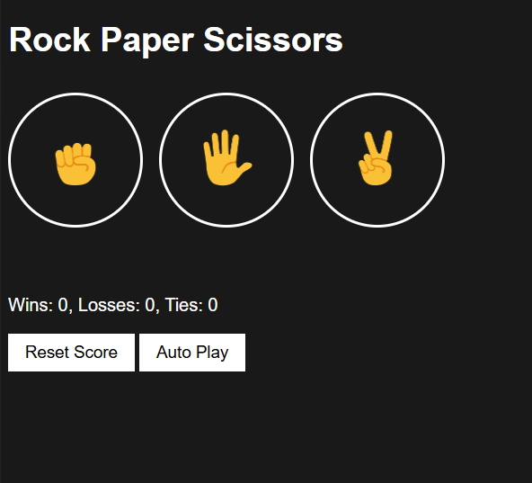
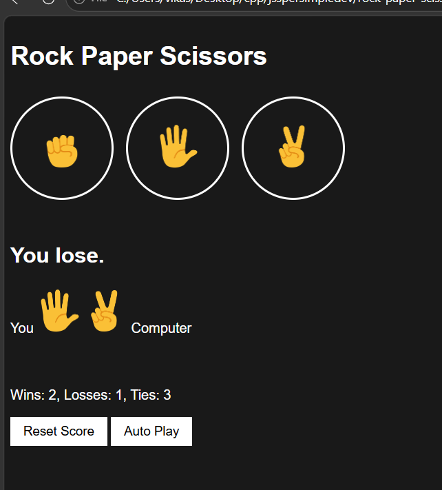

# 🎮 Rock Paper Scissors Game

A simple Rock Paper Scissors game built using HTML, CSS, and JavaScript.

## Features

- 🖱️ Play using Mouse Clicks
- ⌨️ Play using Keyboard Shortcuts (R, P, S)
- 🤖 Auto Play Mode
- 📊 Score Tracking
- 💾 Local Storage Support
- 🔄 Reset Score Functionality

## Game UI

## Keyboard Controls

| Key | Action |
|------|---------|
| R | Rock |
| P | Paper |
| S | Scissors |
| A | Toggle Auto Play |
| Backspace | Reset Score |
## screenshots

## Technologies Used
- HTML
- CSS
- JavaScript

## Author

Vikash Kumar

GitHub: https://github.com/vikash-k9